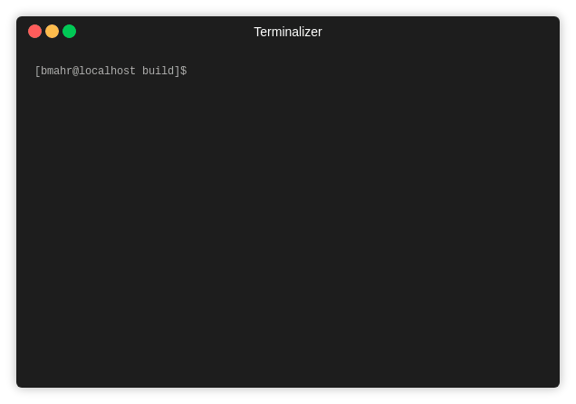

# numericalIntegration

A collection of numerical integration methods, as discussed on [thoughts-on-cpp.com](https://thoughts-on-cpp.com).

[Numerical Methods in C++ Part 1: Newton-Cotes Integration](https://thoughts-on-cpp.com/2019/04/17/numerical-methods-in-c-part-1-newton-cotes-integration)
- Trapezoidal
- Simpson rule
- Romberg

## Getting Started

To get it up and running you just need to execute:
- `~\numericalIntegration\build\cmake .. -DCMAKE_TOOLCHAIN_FILE={YOUR_PATH_TO_VCPKG}/scripts/buildsystems/vcpkg.cmake`
- `~\numericalIntegration\build\cmake --build .`

You can execute the program by `./numericalIntegration`

### Prerequisites

- [fmt](http://fmtlib.net/latest/index.html) external library used for formatting and printing results

## Authors

* **Benjamin Mahr** - [Ben1980](https://github.com/Ben1980)

## License

This project is licensed under the MIT License - see the [LICENSE](LICENSE) file for details
